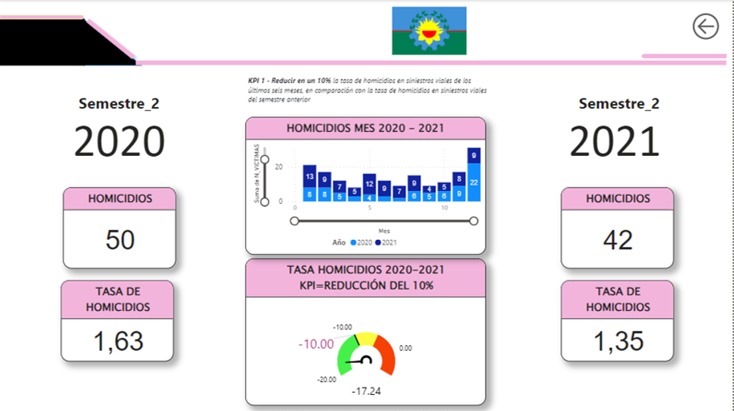

# SINIESTROS VIALES EN LA CIUDAD DE BUENOS AIRES
### Proyecto Individual 2

  

# Generalidades
El observatorio de Movilidad y Seguridad Vial (OMSV) de la ciudad de Buenos Aires nos ha solicitado la elaboración de un proyecto de análisis de datos sobre siniestros viales o accidentes de tránsito generados por diferentes causas como colisiones entre automóviles, motocicletas, bicicletas o peatones, atropellos, choques con objetos fijos o caídas de vehículos y que siempre se ven involucradas personas con consecuencias por lo general graves desde el punto de vista de la siniestralidad. Este análisis va a permitir a las autoridades viales una mejor toma de deciciones a la hora de implementar tanto medidas correctivas como preventivas en la infraestructura vial y en la población.

## Archivos usados para desarrollar el proyecto

- Repositorio de la información sobre Homicidios

1.   [Buenos Aires Data] (https://data.buenosaires.gob.ar/dataset/victimas-siniestros-viales/resource/d445be0a-2a5c-4acb-8899-bce9cb2d378f)
2.  [Archivo Power Bi ]  (Siniestros_viales.pbix)
3.  [Data Set final   ]   (datasets/hechos_victimas_depurados.csv)

## Tecnologías utilizadas en el desarrollo del proyecto

- Python
- Power BI
- GitHub
- Pandas
- Seaborn
- Numpy
- Matplotlib

# Data Engineering

### ETL
Se desarrolló la carga y limpieza de los dos archivos iniciales 'Hechos' y 'VICTIMA', de la depuración se generó un archivo final 'hechos_victimas_depurados.csv' sobre el cual se terminó la depuración para ser usado posteriormente en el EDA.

### EDA

Se realizó un análisis exploratorio de los datos con algunos de siguientes resultados:

### Se graficó con un boxplot la variable 'Edad' 

  

- Las edades en los niveles de accidentalidad estan uniformemente distribuidas entre los 20 y 80 años, con una mediana de 37 años

### Generamos una gráfica de torta sobre la participación de cada COMUNA en la cantidad de accidentes

  

- Se observa que las comunas con mayor participación de accidentes son la 1, 4, 9, 8 y 7

### Graficamos el pareto de participación de las comunas en los accidentes

  

- Obervamos que el pareto de accidentes se generan en las comunas 1, 4, 9, 8, 7, 3, 15, 13 y 12, pero las más significativas son la 1,4,9,8 y 7

### Hacemos un análisis gráfico de las variables categóricas

  

#### De las gráficas se puede concluir lo siguiente:
- En el top 20 de los cruces más comunes de accidentes, vemos que el de mayor accidentalidad es PAZ, GRAL. AV.
- En el análisis de víctimas y la frecuencia de ocurrencia de accidentes, el de mayor participación son las motos, seguidas del peatón
- y la mayor cantidad de accidentalidad está determinada por el sexo masculino

### Realizamos Análisis Bivariado y Multivariado

  

#### Podemos ver en la gráfica de dispersión los siguientes comportamientos de los datos:
- La edad de los accidentes en peatones tiene una distribución normal de 15 a 90 años, con unos outliers de 1, 3 y 95 años. Esto indica que cualquier edad es suceptible de tener un accidente vial.
- En los accidente de motos presenta una distribución normal de los datos de 17 a 60 años, que se condiera una edad normal para manejar este tipo de vehículos.
- Los accidentes de bicicleta tienen un comportamiento parecido a las motos, con menos densidad de datos
- Los accidentes de Cargas, tiene distribución entre 30 y 45 años, que sería una edad normal para este tipo de vehículo.

### Realizamos un análisis de correlación de variables numéricas

  

- Observamos que no hay una correlación fuerte entre las variables del análisis

# DASHBOARD

- Se realizan tableros con la siguiente información:

### Generalidades

  

- muestra datos como: 
-   Siniestros por género y año
-   Total siniestros viáles y total víctimas
-   Víctimas por año
-   Víctimas por tipo de vehículo
-   Comunas (al seleccionar la comuna muestra todos los datos anteriores para la comuna seleccionada)
-   Se tienen los filtros por victima y acusado que permiten ver más en detalle la información respectiva

### KPI 1

- Reducir en un 10% la tasa de homicidios en siniestros viales de los últimos seis meses, en comparación con la tasa de homicidios en siniestros viales del semestre anterior. Definimos a la tasa de homicidios en siniestros viales como el número de víctimas fatales en accidentes de tránsito por cada 100,000 habitantes en un área geográfica durante un período de tiempo específico. Su fórmula es: (Número de homicidios en siniestros viales / Población total) * 100,000

  

- La tasa de homicidios pasó de 1,35 a 1,15, mejorando el 17,24%
  Aunque en general los datos del 2021 respecto al 2020 son parejos, diciembre del 2020 tuvo datos atípicos respecto a la media, seguramente influidos por la necesidad de salir en un año marcado por la pandemia del Covic. 

### KPI 2 y 3

- KPI 2 - Reducir en un 7% la cantidad de accidentes mortales de motociclistas en el último año, respecto al año anterior.
- KPI 3 - Reducir en un 10% la cantidad de accidentes mortales de peatones en el último año, respecto al año anterior

  

- Los accidentes mortales en moto pasaron de  28 a 46 del 2020 al 2021, con un incremento del 64,29%, no cumpliendo la meta de reducción del    7%. 
- Se ve un incremento significativo mes a mes en el 2021 respecto al 2020, en parte por cuenta de la pandemia, en la cual varios meses del     año y por restricción de movilidad la accidentalidad bajó bastante.
- Los accidentes mortales en peatones pasaron de  34 a 33 en los años 2020-2021, con una reducción del 2,94%.
  Esta reducción parece significativa, pero realmente es baja teniendo en cuenta que la movilidad en el año 2020 fue reducida y por ende la accidentalidad.

## CONCLUSIONES

- Se recomienda generar planes de mitigación y prevención vial tanto en peatones como en conductores, esto porque la distribución de muertes  por edad es uniforme, en edades, lo que indica que posiblemente haya que trabajar un poco más la cultura vial.
- Se recomienda hacer campañas viales y se preservación de la vida que motiven a los motociclistas al cuidado en la vía, esto porque este  segmento de conductores con los más afectados en los siniestros viales. 

## Contacto
- [Portafolio]()
- [hector.ocampog@gmail.com]
